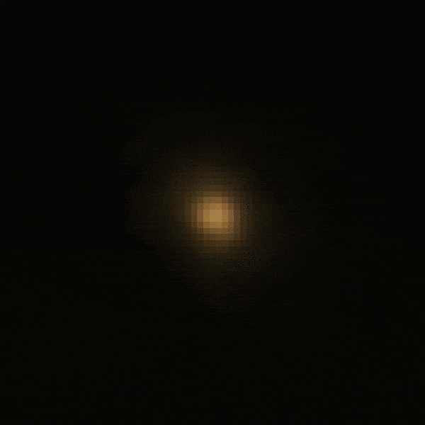
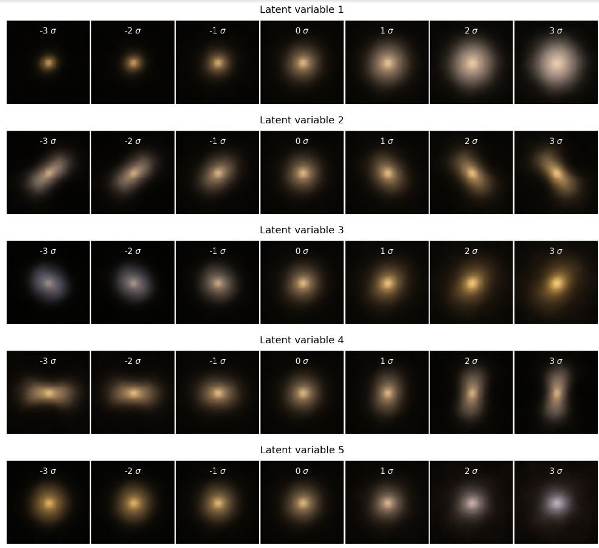

# Autoencoders for galaxy observations

Learning about galaxy images, and perhaps their latent representations, using autoencoders. Interested in reading more? Check out the [blog post](https://jwuphysics.substack.com/p/galaxy-autoencoders)!

 

(*left*) Animation of decoded galaxy images from ELBO-VAE latent space. (*right*) Decoded galaxy images from MMD-VAE latent space.

# Data

The images of galaxies come from the [Sloan Digital Sky Survey (SDSS)](www.sdss.org/) and can be retrieved using their JPG cutout service on [SkyServer](skyserver.sdss.org/).

These images, along with some [GalaxyZoo](https://www.galaxyzoo.org) morphological labels, were compiled by [Henry Leung](https://github.com/henrysky) and [Jo Bovy](https://github.com/jobovy) as part of the [Galaxy10 dataset](https://astronn.readthedocs.io/en/latest/galaxy10.html). Please cite and acknowledge SDSS, [GalaxyZoo](https://ui.adsabs.harvard.edu/abs/2008MNRAS.389.1179L/abstract), and the relevant data releases.

# Code

## Viewing the notebook
If you just want to take a look, it's probably best to use [Jupyter nbviewer](https://nbviewer.jupyter.org/) since there are some large images that Github often fails to load. For example, the first notebook can be viewed [here](https://nbviewer.jupyter.org/github/jwuphysics/galaxy-autoencoders/blob/main/VAEs%20for%20galaxy%20images.ipynb).

## Google Colab
I recommend running this code on [Google Colab](https://colab.research.google.com/github/jwuphysics/galaxy-autoencoders) if possible, since it offers a free GPU and already satisfies all the dependencies.

## Dependencies
If you want to run it locally, Pytorch version `>=1.7`, scikit-learn (sklearn), and the SciPy stack (Numpy/SciPy/matplotlib) are currently needed. Make sure that the `device` parameter is set to `cpu` and not `cuda` if you do not have a GPU.

# Results

After training a *variational* autoencoder, we can sample the latent space along different dimensions in order to see what they represent!

# Acknowledgments
This repo was inspired by a [notebook](https://colab.research.google.com/drive/149Z8pDLj8w5GlLxqTtamcYfPLEaNHuAo?usp=sharing) during the *Machine Learning for Astrophysics and Astrophysics Problems for Machine Learning* NeurIPS 2020 tutorial led by [David W. Hogg](https://github.com/davidwhogg) and [Kate Storey-Fisher](https://github.com/kstoreyf).
