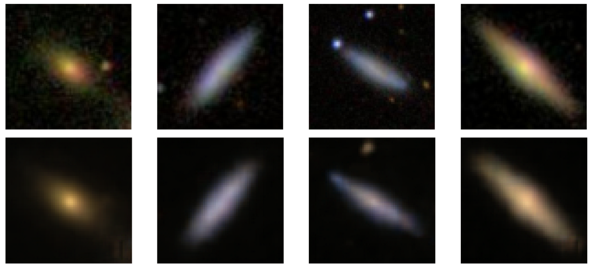

# Autoencoders for galaxy observations

Learning about galaxy images, and perhaps their latent representations, using autoencoders. Inspired by a [notebook](https://colab.research.google.com/drive/149Z8pDLj8w5GlLxqTtamcYfPLEaNHuAo?usp=sharing) during the *Machine Learning for Astrophysics and Astrophysics Problems for Machine Learning* NeurIPS 2020 tutorial led by [David W. Hogg](https://github.com/davidwhogg) and [Kate Storey-Fisher](https://github.com/kstoreyf).

# Data

The images of galaxies come from the [Sloan Digital Sky Survey (SDSS)](www.sdss.org/) and can be retrieved using their JPG cutout service on [SkyServer](skyserver.sdss.org/).

These images, along with some [GalaxyZoo](https://www.galaxyzoo.org) morphological labels, were compiled by Henry Leung and Jo Bovy as part of the [Galaxy10 dataset](https://astronn.readthedocs.io/en/latest/galaxy10.html). Please cite and acknowledge SDSS, [GalaxyZoo](https://ui.adsabs.harvard.edu/abs/2008MNRAS.389.1179L/abstract), and the relevant data releases.

# Software

Pytorch version `>=1.7`, scikit-learn (sklearn), and the SciPy stack (Numpy/SciPy/matplotlib) are currently needed to run the code.
